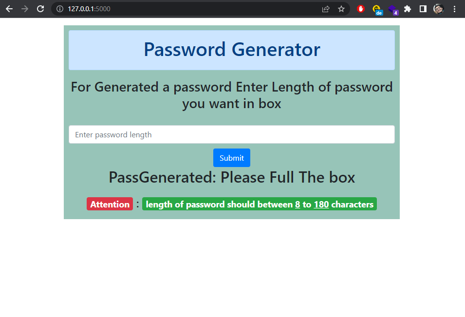
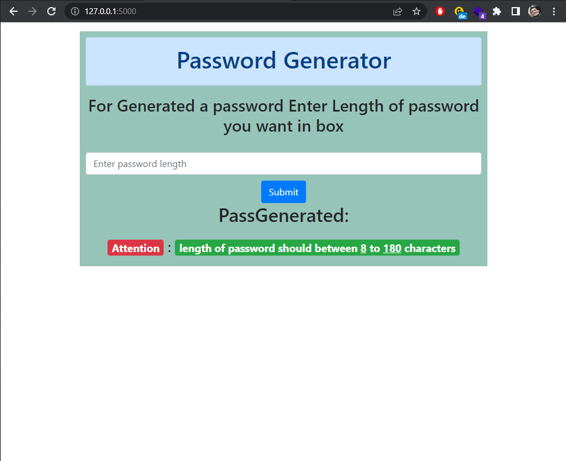
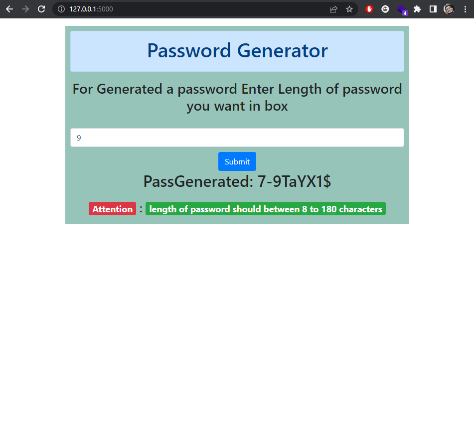

# a Web Application With Flask python for Generate custom Password

## How To Run it:
- windows:

        py -3 -m venv venv  
        .\venv\Scripts\activate.bat

- Linux or Mac:

        python3 -m venv venv
        . venv\bin\activate

Then Install requirements Library's:
        
        pip install -r requirements.txt 

Then Just type: 

        flask run

